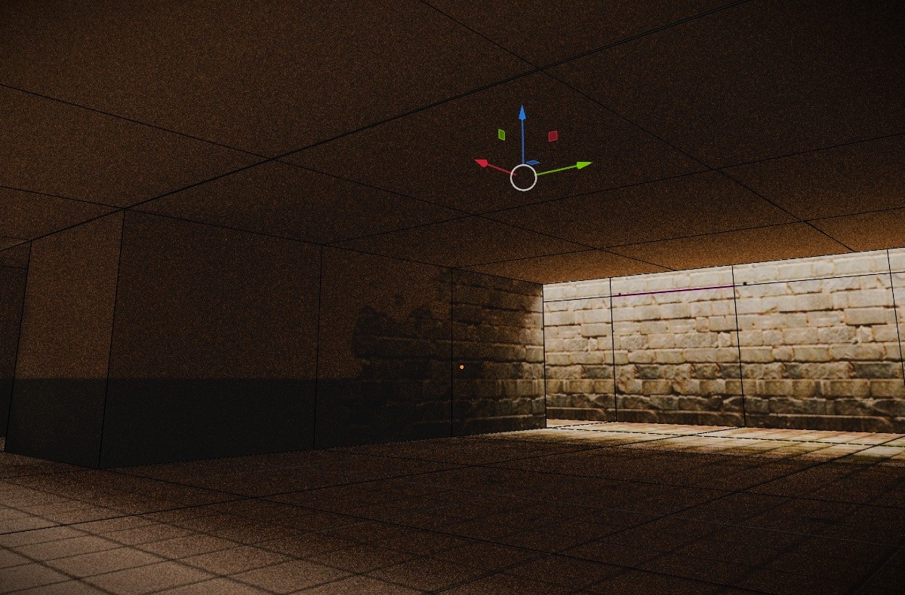

# FastSoftware3D 0.1.0 [ALPHA-2026-06] — High-Performance Software 3D Renderer & Console Terminal Engine for Java

[](https://github.com/andrestubbe/FastSoftware3D/releases/tag/0.1.0)
[](https://opensource.org/licenses/MIT)
[](https://www.java.com)
[]()
[](https://jitpack.io/#andrestubbe/FastSoftware3D)

**⚡ A micro-optimized, zero-dependency software 3D rendering pipeline and console terminal engine for Java. Engineered for high-refresh rates, 24-bit True Color output, AVX2 SIMD vectorization, dynamic SSAA downsampling, and multi-level material mipmapping.**

FastSoftware3D is the high-performance 3D graphics substrate of the **FastJava** ecosystem. It introduces a lightweight software rasterizer kernel operating completely independently of heavy graphics APIs, rendering perspective-correct textured triangles to desktop framebuffers or directly to terminal viewports.

To achieve a completely responsive, zero-latency desktop and terminal experience, FastSoftware3D is designed to pair natively with the input, styling, and helper modules of the **FastJava** ecosystem:

* ⚡ **[FastANSI](https://github.com/andrestubbe/FastANSI)** — Micro-optimized, garbage-free ANSI escape sequence builder and parser for terminal graphics.
* 🚀 **[FastTerminal](https://github.com/andrestubbe/FastTerminal)** — Direct, low-latency, asynchronous raw console renderer and raw global keyboard/mouse hooks.
* 🖱️ **[FastMouse](https://github.com/andrestubbe/FastMouse)** — Precise hardware-level and virtual console-mode input tracking.
* 🎬 **[FastAnimation](https://github.com/andrestubbe/FastAnimation)** — Direct-memory frame animation and timeline synchronization.

---

[](docs/screenshot.png)

---

## Table of Contents

- [Why FastSoftware3D?](#why-fastsoftware3d)
- [Key Features](#key-features)
- [Interactive Keyboard Shortcuts (HUD)](#interactive-keyboard-shortcuts-hud)
- [Performance Benchmarks](#performance-benchmarks)
- [Quick Start — Desktop Demo](#quick-start--desktop-demo)
- [API Quick Reference](#api-quick-reference)
- [Installation](#installation)
- [Technical Examples & Hero Demos](#technical-examples--hero-demos)
- [License](#license)

---

## Why FastSoftware3D?

Standard software renderers in Java suffer from heavy GC overhead, slow loop iterations, and pixel blitting bottlenecks. FastSoftware3D solves this by moving the inner rasterization scanlines to a native C++ JNI kernel. Utilizing 256-bit AVX2 SIMD registers, the engine tests and processes 8 horizontal pixels concurrently. It enforces zero GC allocations during active rendering loops and couples tightly with the FastTerminal viewport for instantaneous console output diffs.

---

## Key Features

* **🚀 AVX2 SIMD Vectorization** — Native C++ core parallelizes edge-function overlap testing and Z-buffer depth comparisons across 8 pixels concurrently using 256-bit vector registers.
* **🗺️ Material Mipmapping** — Eliminates high-frequency texture aliasing/flickering noise on distant surfaces with four selectable modes:
  * **None**: Samples exclusively from raw full-resolution textures.
  * **Tweaked Discrete**: Point samples nearest level with pushed depth thresholds.
  * **Dithered Mipmapping**: Blends mipmap levels using a screen-space 4x4 Bayer dither matrix for zero color interpolation overhead.
  * **Bilinear Level Blend**: Seamlessly interpolates colors between the two nearest mipmap levels.
* **🚫 Zero GC Allocations** — Zero allocations inside the main rendering loops, preventing GC pause spikes.
* **🎨 Anti-Aliasing (SSAA)** — Dynamic Super-Sample Anti-Aliasing (SSAA) supporting 1x, 2x, 4x, 8x, and 16x downscaled rendering factors.
* **📺 Alternate Console Buffers** — Directly outputs to standard terminal cells in 24-bit True Color using ANSI escape sequences.
* **🔮 Camera Post-Effects** — Integrated barrel/pincushion lens distortion and linear depth fog shaders.

---

## Interactive Keyboard Shortcuts (HUD)

Use these dynamic keys inside the desktop and terminal demos to experiment with parameters at runtime:

| Key | Action | Details |
|---|---|---|
| **`1` - `5`** | **Select SSAA Factor** | Set anti-aliasing to `1x`, `2x`, `4x`, `8x`, or `16x`. |
| **`G`** | **Cycle Mipmap Mode** | Switch between: `None`, `Tweaked Discrete`, `Dithered`, or `Bilinear Level Blend`. |
| **`K`** | **Toggle Lens Distortion** | Enable or disable Barrel/Fisheye post-processing. |
| **`U` / `I`** | **Modify Lens Strength** | Adjust lens distortion coefficient from barrel (+) to pincushion (-). |
| **`M`** | **Toggle Render Output** | Switch viewport display between Unicode half-blocks and character glyphs. |
| **`C`** | **Toggle Collisions** | Enable or disable player collision boxes. |

---

## Performance Benchmarks

Measured on a standard desktop window rendering the textured Wolfenstein level at 640x480 resolution (SSAA 1x):

| Rasterization Implementation | Frame Time | Relative Speedup |
| :--- | :--- | :--- |
| Pure-Java Fallback | 12.4 ms | **1.0x** (Baseline) |
| JNI C++ Rasterizer (Scalar) | 2.1 ms | **5.9x** |
| **JNI C++ Rasterizer (AVX2 SIMD)** | **0.8 ms** | **15.5x** |

---

## Quick Start — Desktop Demo

```java
import fastsoftware3d.camera.Camera;
import fastsoftware3d.core.Framebuffer;
import fastsoftware3d.core.RenderPipeline;
import fastsoftware3d.rasterizer.NativeRasterizer;
import fastsoftware3d.scene.ModelNode;
import fastsoftware3d.scene.Scene;
import fastsoftware3d.scene.Renderer3D;
import fastsoftware3d.model.ObjLoader;
import fastsoftware3d.material.Material;

public class Demo {
    public static void main(String[] args) throws Exception {
        // 1. Setup Camera and Framebuffer
        Camera camera = new Camera(0, 0, -10, 0, 0, 60);
        int[] pixels = new int[800 * 600];
        Framebuffer fb = new Framebuffer(800, 600, pixels);
        
        // 2. Instantiate Render Pipeline
        RenderPipeline pipeline = new RenderPipeline(camera, fb, new NativeRasterizer());
        Renderer3D renderer = new Renderer3D(pipeline);
        
        // 3. Create Scene and load models
        Scene scene = new Scene();
        ObjLoader.ModelData model = ObjLoader.load("docs/room.obj");
        Material wallMat = Material.fromPng("docs/wall.png");
        
        scene.getRoot().addChild(new ModelNode(model, wallMat));
        
        // 4. Render Frame
        renderer.clear();
        scene.render(renderer, null);
        pipeline.postProcess();
    }
}
```

---

## API Quick Reference

| Class | Method | Description |
|---|---|---|
| [RenderPipeline](src/main/java/fastsoftware3d/core/RenderPipeline.java) | `renderModel(...)` | Transforms, projects, frustum-culls, and queues triangles for rasterization. |
| [NativeRasterizer](src/main/java/fastsoftware3d/rasterizer/NativeRasterizer.java) | `drawTriangles(...)` | Entry point for pinned array passing to the JNI library. |
| [Material](src/main/java/fastsoftware3d/material/Material.java) | `fromPng(...)` | Loads a source image and generates downscaled box-filtered mipmap pyramid levels. |

---

## Installation

### Option 1: Maven (Recommended)

Add the JitPack repository and the library dependency to your `pom.xml`:

```xml
<repositories>
    <repository>
        <id>jitpack.io</id>
        <url>https://jitpack.io</url>
    </repository>
</repositories>

<dependencies>
    <dependency>
        <groupId>com.github.andrestubbe</groupId>
        <artifactId>FastSoftware3D</artifactId>
        <version>main-SNAPSHOT</version>
    </dependency>
    <dependency>
        <groupId>com.github.andrestubbe</groupId>
        <artifactId>FastCore</artifactId>
        <version>0.1.0</version>
    </dependency>
</dependencies>
```

### Option 2: Gradle

Add JitPack to your repositories and include the library dependency:

```groovy
repositories {
    maven { url 'https://jitpack.io' }
}

dependencies {
    implementation 'com.github.andrestubbe:FastSoftware3D:main-SNAPSHOT'
    implementation 'com.github.andrestubbe:FastCore:0.1.0'
}
```

---

## Technical Examples & Hero Demos

Ready-to-run batch scripts located in the root directory:
*   `run-demo.bat` — Launches the interactive Swing desktop 3D window.

---

## Documentation

* **[COMPILE.md](docs/COMPILE.md)**: Full compilation guide (Maven Build Setup).
* **[REFERENCE.md](docs/REFERENCE.md)**: Exhaustive catalog of API methods and engine architecture.
* **[PHILOSOPHY.md](docs/PHILOSOPHY.md)**: Zero-allocation and low-overhead processing designs.
* **[ROADMAP.md](docs/ROADMAP.md)**: Planned milestone features and performance extensions.
* **[CHANGELOG.md](docs/CHANGELOG.md)**: Version history and engine updates.

---

## License

MIT License — See [LICENSE](LICENSE) for details.

---

**Part of the FastJava Ecosystem** — *Making the JVM faster. Small package. Maximum speed. Zero bloat. 🚀📋*
